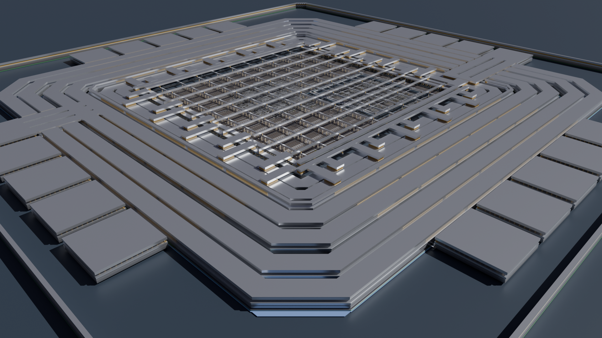
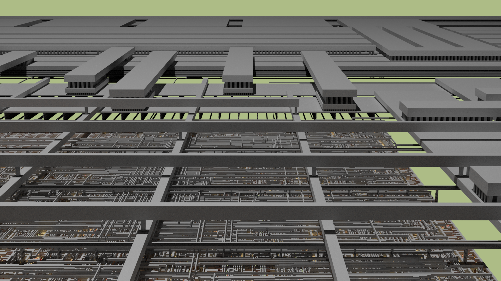
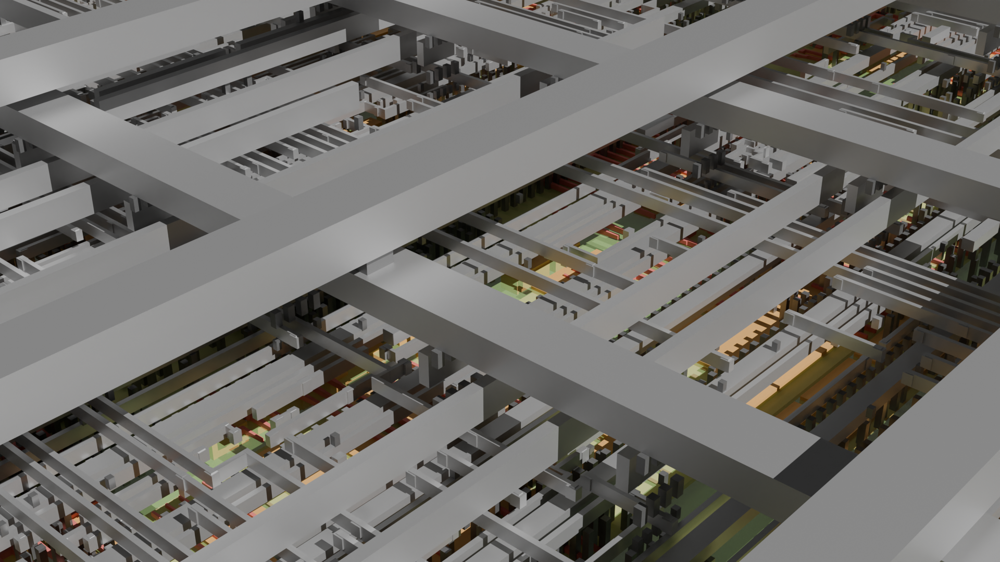
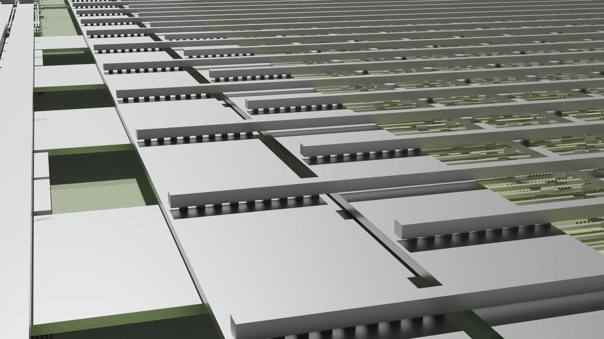

Open Source I2C GPIO Expander
=============================

This project offers an open-source I2C GPIO Expander, fully implemented in SpinalHDL and designed to work seamlessly with the OpenROAD toolchain. The expander is tailored for use with the IHP Open SG13G2 PDK, providing a complete open-source solution from RTL to GDSII without any reliance on proprietary software.

Features
########

* **SpinalHDL Implementation**: The design is entirely written in SpinalHDL, without using Verilog or VHDL.
* **Open-Source Toolchain**: The project exclusively uses open-source tools, ensuring compatibility without proprietary dependencies.

  * **Design Verification**: Conducted using Yosys and nextpnr.

  * **Chip Layout**: Created using the OpenROAD flow.

* **I2C Fast Mode**: Supports high-speed I2C communication at up to 400 kbit/s.
* **Configurable GPIO Width**: Provides a flexible design allowing customization of GPIO widths to meet specific needs.
* **Configurable Address Width**: Allows the I2C address width to be configured as required.

This project is an excellent choice for those seeking a customizable I2C GPIO expander with full support from open-source tools and platforms.

Layout Rendering
#################

A rendering of the complete I2C GPIO Expander layout.

View of standard cells alongside some I/O cells.

A closer look at the power/ground mesh and selected cells.

The power distribution network: Power and ground I/O cells on the left are connected to the central power/ground ring, distributing through a mesh on the right to supply each cell.

Installation
############

This project uses Taskfile as its task runner tool. You can install Taskfile using Snap or an alternative package manager for your distribution (e.g., Ubuntu). Once installed, run the `install` task to download and set up all dependencies.

- Install Taskfile and virtualenv::

        sudo snap install task --classic
        sudo apt install virtualenv curl podman

- Set up the project::

        task install

- List all available tasks::

        task -a

**Note:** By default, the X-Server is required for the `view-klayout` and `view-openroad` tasks. On headless systems, you can bypass this requirement by adding `IS_HEADLESS=true` before the task command. This is particularly useful when accessing the system via SSH, as it allows you to run the container without the need for X-Server.

Register Map
############

+----------+-----------+--------+----------------------+
| Register | Name      | Access | Description          |
+==========+===========+========+======================+
| 0x0      | Value     | R      | Returns IO value     |
+----------+-----------+--------+----------------------+
| 0x1      | Write     | R/W    | Writes output value  |
+----------+-----------+--------+----------------------+
| 0x2      | Direction | R/W    | Enables output value |
+----------+-----------+--------+----------------------+

FPGA Flow
#########

Start by generating the necessary files for the ECPIX5 Board, then synthesize the design.

.. code-block:: text

    task fpga-prepare fpga-synthesize

Next, program the ECP5 FPGA with the synthesized bitstream.

.. code-block:: text

    task fpga-flash

Connect PMOD0 pin 0 (SCL) and pin 1 (SDA) to an I2C Controller (Master) interface.

ASIC Flow
#########

The ASIC flow closely resembles the FPGA flow. Begin by generating all required files, then proceed with chip layout creation and filler insertion.

.. code-block:: text

    task prepare layout filler

If the chip layout process fails, consult the **Known Issues** section for troubleshooting tips.

Finally, review the chip layout using OpenROAD or KLayout.

.. code-block:: text

    task view-klayout
    task view-openroad

Earlier stages of the layout process can also be reviewed in OpenROAD by passing the `stage` argument.

.. code-block:: text

    task view-openroad stage=6_final

Design Rule Checks
##################

Use the following tasks to perform Design Rule Checks (DRC) on the chip layout. Minimal checks can be run as follows:

.. code-block:: text

    task run-drc level=minimal
    task view-drc level=minimal

To run an enhanced rule set, use the standard DRC commands:

.. code-block:: text

    task run-drc
    task view-drc

Tape-out
########

The default task runs the complete RTL-to-GDSII tape-out flow in one step. The final GDS file undergoes a comprehensive DRC check and is prepared for tape-out.

.. code-block:: text

    task

Known Issues
############

- **M2.d Errors**: OpenROAD generates excessively small segments on M2 when connecting Via1 to Via2.

License
#######

Copyright (c) 2024 aesc silicon. Released under the `GPLv3 license`_.

.. _GPLv3 license: COPYING.GPLv3
.. _zephyr/README: zephyr/README.rst
