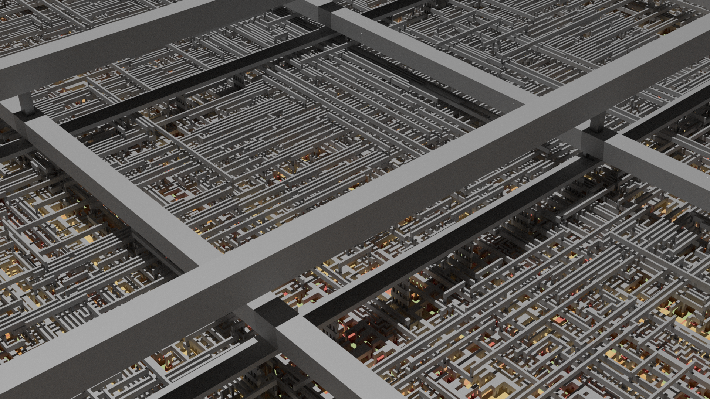

Open Source I2C Gpio Expander
=============================

An Open Source I2C GPIO Expander written in SpinalHDL. Chip layouts for the SKY130 and SG13G2 PDKs are avaibale for the open RTL-to-GDSII tool OpenROAD.

Features
########

* Fully written in SpinalHDL. No line of Verilog/VHDL.
* Only Open Source tools and no proprietary vendor tools.

  * Design verification with Yosys+nextpnr.
  * Chip layout with OpenROAD.

* I2C Fast Mode with 400 kbit/s
* Configurable GPIO width
* Configurable address width

Layout Rendering
#################

Rendering of the standard cells and some IO cells.

Closer look at the power/ground mesh and some cells.

Power distribution network. The power/ground IO cells on the left side are connected to the power/ground ring in the center. The power/ground mesh on the right side connects the ring with each cell.

.. image:: images/chip_power_network.png
  :alt: I2C Gpio Expander Chip Layout

Installation
############

This project comes with a container image which has all required host dependencies installed. Therefore, only the sources have to be locally installed and you keep your host system clean.

- Install podman::

	sudo apt install podman
	pip3 install podman-compose==1.0.6 --user

- Build a container::

        podman-compose build

- Download all sources::

        curl https://storage.googleapis.com/git-repo-downloads/repo > repo
        chmod a+rx repo
        ./repo init -u https://github.com/aesc-silicon/i2c-gpio-expander.git -b main -m manifest.xml
        ./repo sync

- Podman might fail with `WARN[0000] Error validating CNI config file...` on Ubuntu systems. This can be fixed by manually installing a newer version of `containernetworking-plugins`::

        curl -O http://archive.ubuntu.com/ubuntu/pool/universe/g/golang-github-containernetworking-plugins/containernetworking-plugins_1.1.1+ds1-3build1_amd64.deb
        sudo dpkg -i containernetworking-plugins_1.1.1+ds1-3build1_amd64.deb

Register Map
############

+----------+-----------+--------+----------------------+
| Register | Name      | Access | Description          |
+==========+===========+========+======================+
| 0x0      | Value     | R      | Returns IO value     |
+----------+-----------+--------+----------------------+
| 0x1      | Write     | R/W    | Writes output value  |
+----------+-----------+--------+----------------------+
| 0x2      | Direction | R/W    | Enables output value |
+----------+-----------+--------+----------------------+

Container
#########

Start the Elements container in the background with following command:

.. code-block:: text

    podman-compose up -d

Afterwards, run the following command and replace `<target>` with one from the Makefile.

.. code-block:: text

    podman exec --workdir=$PWD -it i2c-gpio-expander_container bash -c 'make <target>'

FPGA Flow
#########

First, generate the required files for the ECPIX5 Board and afterwards, synthesize it.

.. code-block:: text

    podman exec --workdir=$PWD -it i2c-gpio-expander_container bash -c 'make ecp5-generate'
    podman exec --workdir=$PWD -it i2c-gpio-expander_container bash -c 'make ecp5-synthesize'

Next, flash the bitstream into the ECP5 FPGA.

.. code-block:: text

    podman exec --workdir=$PWD -it i2c-gpio-expander_container bash -c 'make ecp5-flash'

Connect PMOD0 pin 0 (SCL) and pin 1 (SDA) to an I2C Controller (Master) interface.

ASIC Flow
#########

The ASIC flow is similar to the FPGA one. Generate all required files at the beginning and start the chip layout.

.. code-block:: text

    podman exec --workdir=$PWD -it i2c-gpio-expander_container bash -c 'make sky130-generate'
    podman exec --workdir=$PWD -it i2c-gpio-expander_container bash -c 'make sky130-synthesize'

Please check Known Issues in case the chip layout failed.

Finally, open the chip layout and inspect the layout.

.. code-block:: text

    podman exec --workdir=$PWD -it i2c-gpio-expander_container bash -c 'make sky130-openroad'

Similar targets are available for the IHP SG13G2 PDK:

.. code-block:: text

    podman exec --workdir=$PWD -it i2c-gpio-expander_container bash -c 'make sg13g2-generate'
    podman exec --workdir=$PWD -it i2c-gpio-expander_container bash -c 'make sg13g2-synthesize'

Open the design with either OpenROAD or Klayout:

.. code-block:: text

    podman exec --workdir=$PWD -it i2c-gpio-expander_container bash -c 'make sg13g2-openroad'
    podman exec --workdir=$PWD -it i2c-gpio-expander_container bash -c 'make sg13g2-klayout'

Design Rule Checks
##################

The following targets run Design Rule Checks for the chip layout. The first two run the minimal set.

.. code-block:: text

    podman exec --workdir=$PWD -it i2c-gpio-expander_container bash -c 'make sg13g2-drc-minimal'
    podman exec --workdir=$PWD -it i2c-gpio-expander_container bash -c 'make sg13g2-drc-minimal-gui'

The following two run an enhanced set of rules.

.. code-block:: text

    podman exec --workdir=$PWD -it i2c-gpio-expander_container bash -c 'make sg13g2-drc-maximal'
    podman exec --workdir=$PWD -it i2c-gpio-expander_container bash -c 'make sg13g2-drc-maximal-gui'

Known Issues
############

* OpenROAD will always fail with "[ERROR] LEF Cell 'sky130_fd_pr__gendlring__example_559591418081' has no matching GDS/OAS cell. Cell will be empty." during the first time synthesizing the chip. Run `syk130-synthesize` again to finish the layout.

License
#######

Copyright (c) 2024 aesc silicon. Released under the `MIT license`_.

.. _MIT license: COPYING.MIT
.. _zephyr/README: zephyr/README.rst
