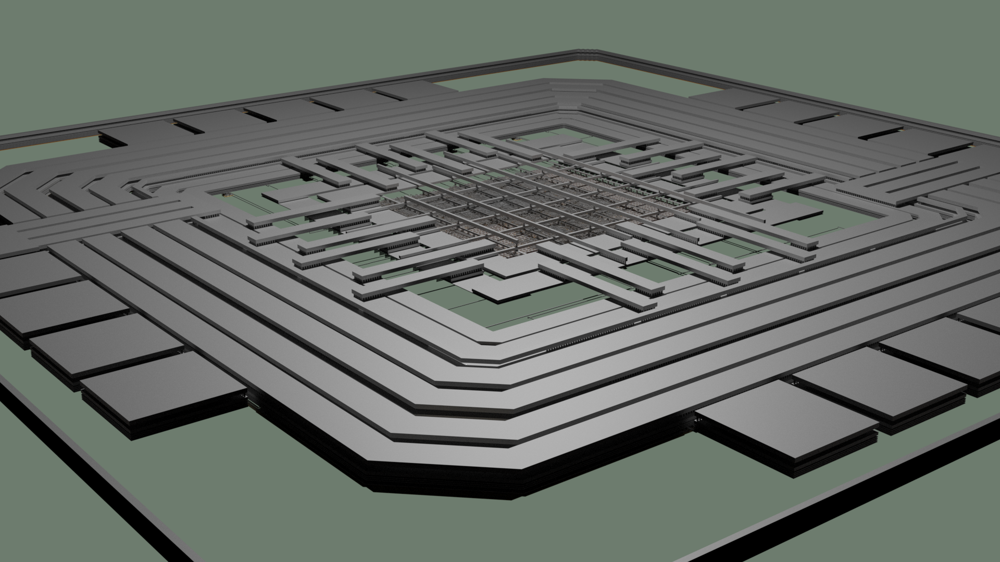
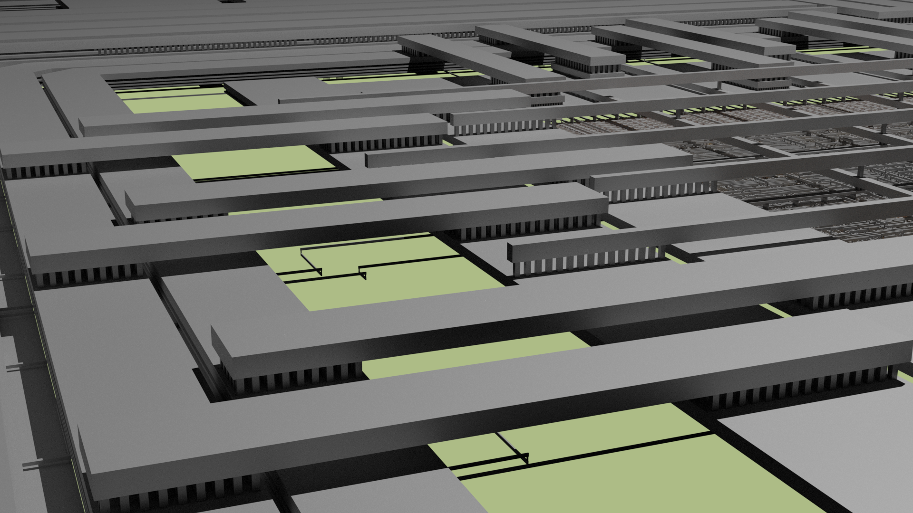

Open Source I2C Gpio Expander
=============================

This project provides an open-source I2C GPIO Expander, fully written in SpinalHDL, and designed for use with the OpenROAD toolchain. The expander is compatible with the SG13G2 PDK, offering a complete open-source solution from RTL to GDSII without relying on proprietary tools.

Features
########

* **SpinalHDL Implementation**: The entire design is written in SpinalHDL, with no Verilog or VHDL code.
* **Open-Source Toolchain**: The project uses only open-source tools, avoiding proprietary software.

  * **Design Verification**: Performed using Yosys and nextpnr.

  * **Chip Layout**: Achieved with OpenROAD.

* **I2C Fast Mode**: Supports I2C communication at 400 kbit/s.
* **Configurable GPIO Width**: Flexible design allows customizable GPIO widths based on requirements.
* **Configurable Address Width**: The I2C address width can also be configured as needed.

This project is ideal for those looking to implement a customizable I2C GPIO expander with full support from open-source tools and platforms.

Layout Rendering
#################

Rendering of the entire I2C GPIO Expander.

Standard cells alongside some I/O cells.

.. image:: images/chip_logic.png
  :alt: I2C Gpio Expander Chip Layout

A detailed view of the power/ground mesh and selected cells.

.. image:: images/chip_logic_closer.png
  :alt: I2C Gpio Expander Chip Layout

The power distribution network: Power and ground I/O cells on the left connect to the central power/ground ring, which distributes through a mesh on the right to supply each cell.

Installation
############

This project comes with a container image which has all required host dependencies installed. Therefore, only the sources have to be locally installed and you keep your host system clean.

- Install podman::

       sudo apt install podman virtualenv
       virtualenv venv
       source venv/bin/activate
       pip3 install podman-compose==1.0.6

- Build a container::

        podman-compose build

- Download all sources::

        curl https://storage.googleapis.com/git-repo-downloads/repo > repo
        chmod a+rx repo
        ./repo init -u https://github.com/aesc-silicon/i2c-gpio-expander.git -b main -m manifest.xml
        ./repo sync

- Podman might fail with `WARN[0000] Error validating CNI config file...` on Ubuntu systems. This can be fixed by manually installing a newer version of `containernetworking-plugins`::

        curl -O http://archive.ubuntu.com/ubuntu/pool/universe/g/golang-github-containernetworking-plugins/containernetworking-plugins_1.1.1+ds1-3build1_amd64.deb
        sudo dpkg -i containernetworking-plugins_1.1.1+ds1-3build1_amd64.deb

Register Map
############

+----------+-----------+--------+----------------------+
| Register | Name      | Access | Description          |
+==========+===========+========+======================+
| 0x0      | Value     | R      | Returns IO value     |
+----------+-----------+--------+----------------------+
| 0x1      | Write     | R/W    | Writes output value  |
+----------+-----------+--------+----------------------+
| 0x2      | Direction | R/W    | Enables output value |
+----------+-----------+--------+----------------------+

Container
#########

Start the Elements container in the background with following command:

.. code-block:: text

    podman-compose up -d

Afterwards, run the following command and replace `<target>` with one from the Makefile.

.. code-block:: text

    podman exec --workdir=$PWD -it i2c-gpio-expander_container bash -c 'make <target>'

FPGA Flow
#########

First, generate the required files for the ECPIX5 Board and afterwards, synthesize it.

.. code-block:: text

    podman exec --workdir=$PWD -it i2c-gpio-expander_container bash -c 'make ecp5-generate'
    podman exec --workdir=$PWD -it i2c-gpio-expander_container bash -c 'make ecp5-synthesize'

Next, flash the bitstream into the ECP5 FPGA.

.. code-block:: text

    podman exec --workdir=$PWD -it i2c-gpio-expander_container bash -c 'make ecp5-flash'

Connect PMOD0 pin 0 (SCL) and pin 1 (SDA) to an I2C Controller (Master) interface.

ASIC Flow
#########

The ASIC flow is similar to the FPGA one. Generate all required files at the beginning and start the chip layout.

.. code-block:: text

    podman exec --workdir=$PWD -it i2c-gpio-expander_container bash -c 'make sg13g2-generate'
    podman exec --workdir=$PWD -it i2c-gpio-expander_container bash -c 'make sg13g2-synthesize'

Please check Known Issues in case the chip layout failed.

Finally, open the chip layout and inspect the layout with either OpenROAD or Klayout.

.. code-block:: text

    podman exec --workdir=$PWD -it i2c-gpio-expander_container bash -c 'make sg13g2-openroad'
    podman exec --workdir=$PWD -it i2c-gpio-expander_container bash -c 'make sg13g2-klayout'

Design Rule Checks
##################

The following targets run Design Rule Checks for the chip layout. The first two run the minimal set.

.. code-block:: text

    podman exec --workdir=$PWD -it i2c-gpio-expander_container bash -c 'make sg13g2-drc-minimal'
    podman exec --workdir=$PWD -it i2c-gpio-expander_container bash -c 'make sg13g2-drc-minimal-gui'

The following two run an enhanced set of rules.

.. code-block:: text

    podman exec --workdir=$PWD -it i2c-gpio-expander_container bash -c 'make sg13g2-drc-maximal'
    podman exec --workdir=$PWD -it i2c-gpio-expander_container bash -c 'make sg13g2-drc-maximal-gui'

Known Issues
############

-

License
#######

Copyright (c) 2024 aesc silicon. Released under the `GPLv3 license`_.

.. _GPLv3 license: COPYING.GPLv3
.. _zephyr/README: zephyr/README.rst
